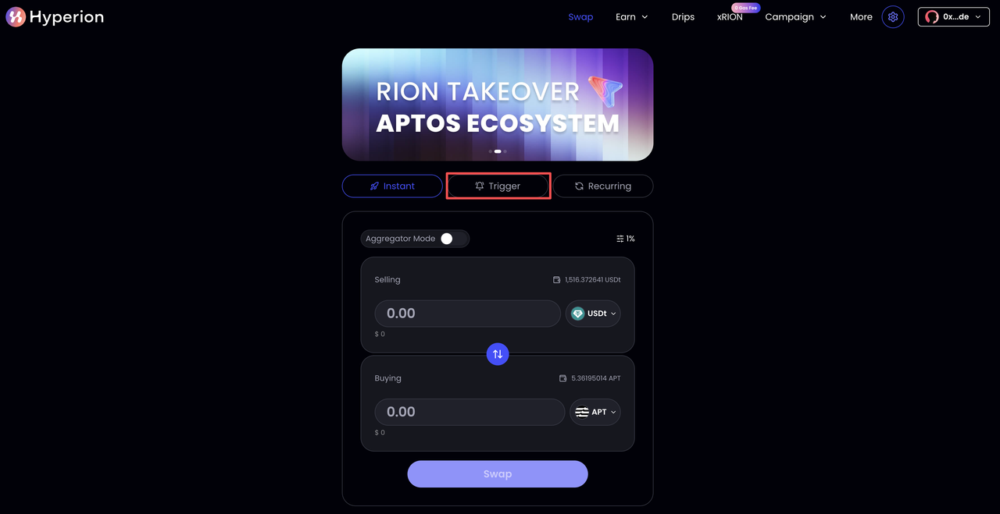

# How to Place a Limit Order

The **Trigger** function allows users to place **on-chain limit orders** directly within the DEX. Instead of executing at the current market price, users can specify a **target rate** and **execution parameters**.

#### **Key Features**

* **Sell Amount**: The quantity of the selected token to sell (e.g., USDT)
* **Buy Amount**: The amount of the counter token expected at the target rate (e.g., APT).
* **Rate**: The limit price (e.g., 1 APT = 3.981161 USDT).
* **Expiry**: Order validity (e.g., Never, 1 day, 1 week).
* **Execution Fee**: Paid only **upon successful execution**; rewarded to the executor.
* **Gas Fee**: Covers network cost, paid to the executor.
* **Platform Fee**: Charged by the DEX, currently free.

Hyperion is an **open protocol** — anyone can execute Trigger orders and earn the Execution and Gas fees. Users only pay these fees when their orders are successfully executed.

Users create a Trigger order by confirming these parameters. Once the market price reaches the set rate, the trade is executed automatically on-chain.

***

### Guide

1. Select Trigger Mode, On the **Swap page**, choose **Trigger** from the mode selector (highlighted in red). This switches from **Instant Swap** to **Limit Order(Trigger)** functionality.

<figure><figcaption></figcaption></figure>

2. Enter Order Details

* **Selling**: Enter the amount and token you want to sell.
* **Buying**: The system calculates the equivalent amount of the token you will receive.
* **Rate**: Adjust your desired limit price.
* **Expiry**: Set how long the order remains valid (e.g., Never, 1 day, 1 week).

⚠️ **Important:** The _Rate_ field defines your execution price.

<figure><figcaption></figcaption></figure>

3. Create Order

* Review the Trigger Summary, then click **Create Order** (highlighted in red)
* The summary includes:
  * **Sell Amount**
  * **Target Rate**
  * **Expected Buy Amount**
  * **Expiry, Fees, and Gas Costs**

<figure><figcaption></figcaption></figure>

4. Manage Open Orders

* After submission, your order appears under **Open Orders** (red box).
* Each order displays:
  * Amount
  * Target rate
  * Expected tokens to receive
  * Execution progress
* Options available:
  * **Cancel Order** (individually)
  * **Cancel All** (for batch cancellation)

<figure><figcaption></figcaption></figure>


