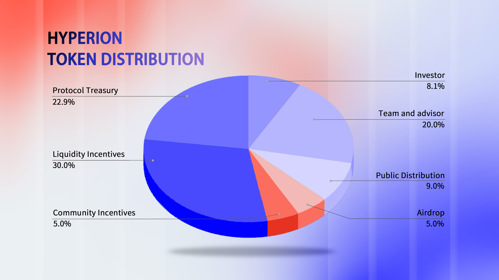
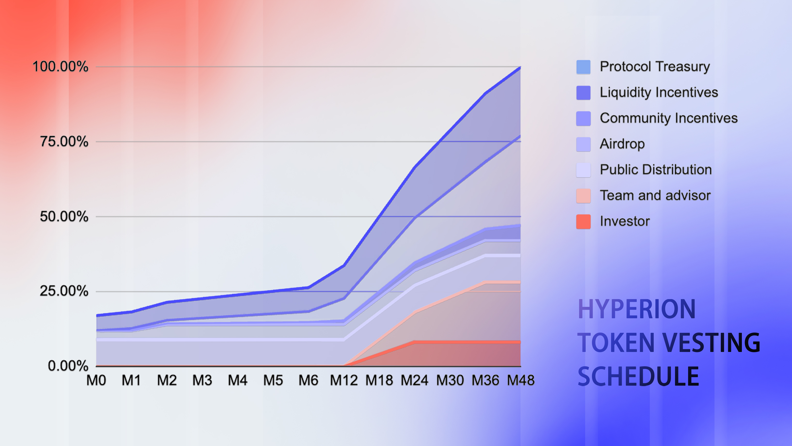

# RION Token

**Basic Information**

* **Name**: Hyperion Token
* **Ticker**: RION
* **Chain**: Aptos
* **Total Supply (Max)**: 100,000,000 RION
* **Token Contract Address**: 0x435ad41e7b383cef98899c4e5a22c8dc88ab67b22f95e5663d6c6649298c3a9d (Aptos)

### Overview

RION is the native, cryptographically-secure, and fungible token of the Hyperion platform. As a transferable token, RION serves utility functions as specified on the Hyperion platform.&#x20;

RION serves as a versatile utility token, facilitating decentralized exchange and settlement among participants within the Hyperion platform. The primary objective of RION is to provide a secure and efficient means of transaction between platform participants, eliminating the need for intermediaries such as centralized entities or institutions. RION is **not**, and is **not intended to be**, a medium of exchange accepted by the general public (or any section of the public) as payment for goods, services, or the discharge of debt, nor is it intended to be used for any purposes other than those exclusively provided by the issuer.

RION is awarded as an economic incentive to encourage user contributions and participation on the platform, establishing a mutually beneficial structure where participants are fairly rewarded based on their efforts. The distribution of additional RION is strictly dependent on actual usage, activity, and contributions to the platform—such as frequency and volume of transactions. Users who do not actively participate or contribute will not receive RION incentives.

<figure><figcaption></figcaption></figure>

<figure><figcaption></figcaption></figure>

### Disclaimer

RION does not represent any shareholding, ownership, participation, right, title, or interest in Hyperion, their affiliates, or any other company, enterprise, or undertaking. RION does not entitle token holders to any promise of fees, dividends, revenue, profits, or investment returns, and is not intended to constitute securities in any jurisdiction, including the United States, British Virgin Islands, Hong Kong, Panama, or Singapore. RION may only be utilized within the Hyperion platform, and ownership confers no rights, express or implied, other than the right to use RION to interact with and utilize the Hyperion platform. The secondary market price of RION is not dependent on the efforts of the Hyperion Project contributors, and there are no mechanisms or schemes in place to control or manipulate secondary market pricing. RION holders are not entitled to vote on the operation or management of Hyperion, their affiliates or their assets, nor does RION constitute any equity interest or collective investment scheme. The arrangement is not intended to be any form of joint venture or partnership.


